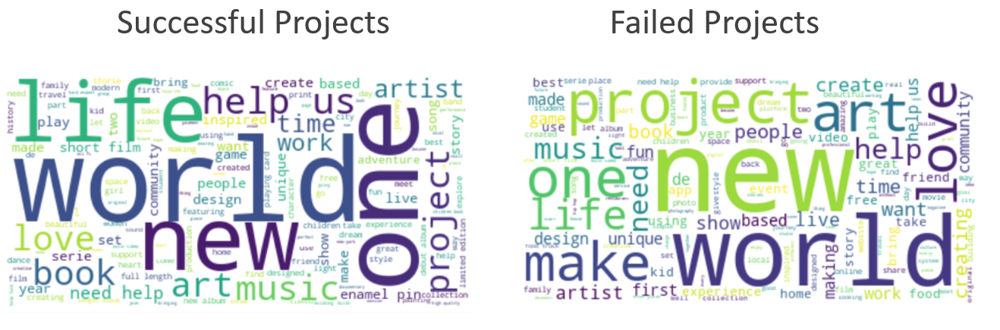
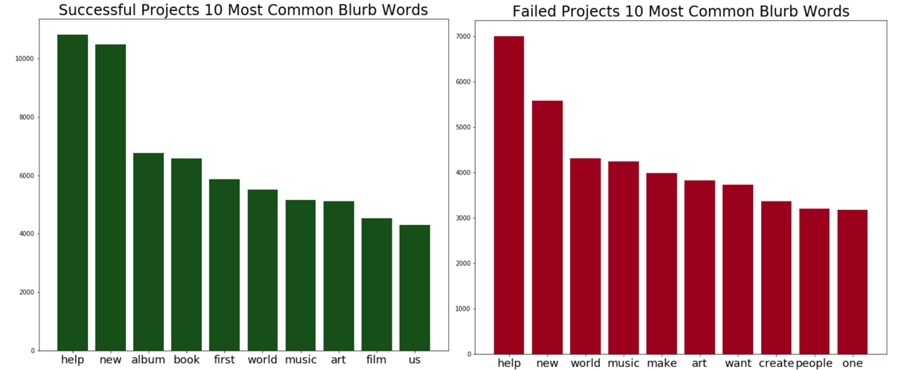
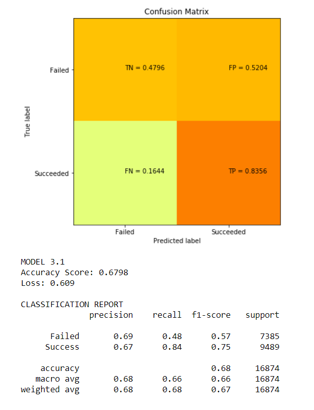
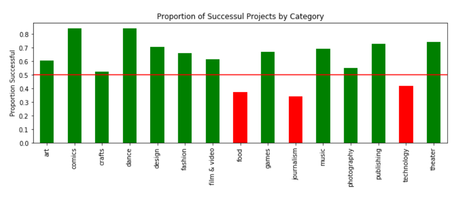
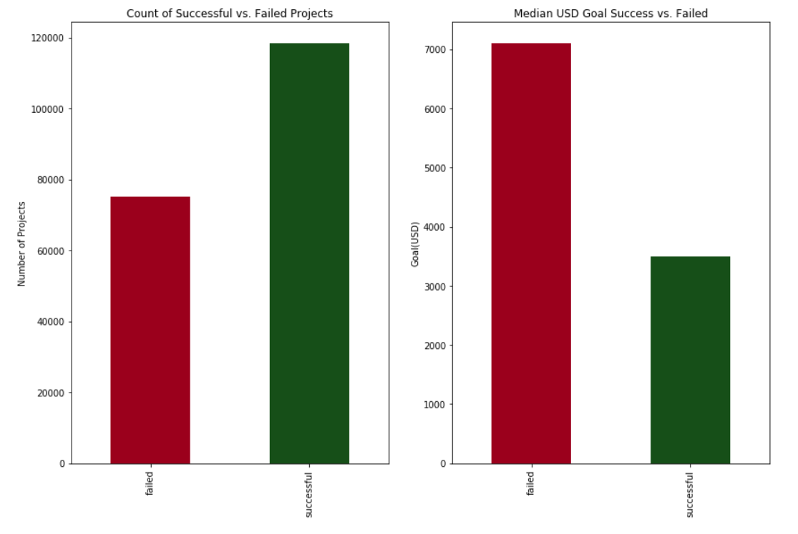
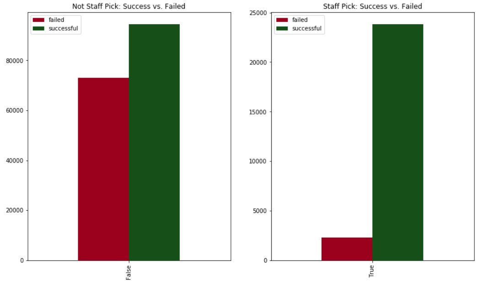

# Kickstarter Success Prediction Using Project Descriptions

Kickstarter has long been a launching platform for innovative products and services. However, only 37% of projects launched on the website reach their funding goal. Moreover, 82% of projects that fail reach less than 20% of their funding goal. On every kickstarter project page, there is a title and short (2-4 sentences) description of the project for potential backers to read. 

The purpose of this project was to analyze the descriptions of these projects (sometimes called blurbs), and examine verbal differences between failed and successful projects. Ultimately, this project builds a predictive model for classifying Kickstarter success using only natural language processing on the blurbs. At the end, there is also a brief exploration of non-blurb features that influence Kickstarter success.

## Problem Statement: Is it possible to build a model that will predict whether or not a Kickstarter project will reach its funding goal using only the description of the project?

## Data Source Overview

This data was pulled from a webrobot that routinely collects information on all of kickstarters projects.
SOURCE: https://webrobots.io/kickstarter-datasets/

## Scrubbing and Updating the Data

The data was in really good shape to begin with from the CSV file I downloaded from webrobots. For the first portion of this project looking only at the blurbs, I isolated the blurb, name of the project, and state (success or failed). 

## Exploratory Data Analysis

As I entered this project, I knew EDA was going to be a key aspect of my project. Within EDA, I hoped to find trends for words or phrases that when included in the blurb made it more likely a project would succeed. 

The way I originally went about this was through word clouds and frequency distributions for both failed and successful projects. See some visualization highlights below.

## Modeling

### Modeling Part 1: Preprocessing through Embedding

With the blurbs in their original string format, it was impossible for a machine learning/deep learning algorithm to classify success vs. failure because these algorithms are not built to process strings. Therefore my first step was to clean the strings and then convert them into numerical representations that could be processed by a classification model.

I took the following stpes in the preprocessing phase

* Removed stop words (the, you, him, is, do, etc.)
* Remove punctuation
* Lowercase everything

My next step was to vectorize the data, using a package called Keras. Essentially this method creates word vectors that focus on capturing the semantic meaning between words and reducing the dimensionality of the data.

### Deep Learning Modeling

I knew I wanted to attempt a neural network to classify whether or not a project would reach its goal using only the description text. Below is a brief description of the different layers I used in various iterations of my model.

* Input layer: First layer of the neural network that takes input values (lists of words in this case) and passes them to the next layer
* Embedding layer: Words(already preprocessed through tokenization and sequencing) are projeted into a limited dimension vector space, thereby reducing the model size and eliminating the curse of dimensionality that comes with spare vectors. Its output is a list of coordinates for the words in my limited dimension vector space. Above, I've set it up so the size of the resulting embedding vector is 128, but this can be tuned.
* LSTM layer: Specialized layer which effectively deals with vanishing and exploding gradients. These layers effectively learn which information is important enough to remember and what can be forgotten in sequence models.
* Pooling layer: Downsamples output of prior layer but retains information from that layer
* Dropout layer: A method to reduce overfitting by downsampling and removing nodes from the previous layer. I use two in my initial model but will vary this in future variations.
* Dense layer: Classic "hidden layer", a linear operation is applied to every input and given a weight and an activation.
* Output layer: Last layer of the network puts the data into desired classes using an activation function- in this case softmax.

### Modeling Part 2: NLP Deep Learning Modeling Results

Ultimately, I ended up using an optimized version of a recurrent neural network using pre-trained word embeddings. The results of the model are summarized in the picture below.

After doing deep learning analysis. I also ran the vectorized text through 4 other machine learning models: logistic regression, random forest, multinomial, and k-nearest neighbors. See the project notebook for more on this. 

### Examining other Kickstarter success factors

Having achieved a pretty high accuracy score for both deep learning models and machine learning models, I wanted to explore other attributes of Kickstarter projects outside of the blurbs. This project is primarily a Natural Language Processing (NLP) project, but for the sake of reccomendations I want to do some quick EDA to determine what attributes make a kickstarter project more likely to be successful. As I began this process there was really 4 questions I wanted to answer.

* Are certain categories of projects inherently more successful?
* Do certain countries have higher success rates for their projects?
* What are the differences between successful and failed projects in regards to goal, backer count, and amount pledged?
* Are projects picked by staff more likely to succeed?

Below are selected visuals that I used to attempt to answer these questions. Please refer to the notebook for more detail. 

# Conclusion & Recommendations

Overall, I feel satisfied having built a functional classification model that can achieve 68% success by only reading the blurb of a project. Through EDA and some model tweaking, I learrned severl interesting things about Kickstarter.

### Observations

* Using words like help, new, album, and book might increase your chances of success in your blurb, but other factors besides the blurb are more important than the exact blub verbage.
* Technology and food projects fail the most often, but also have the highest average ask.
* Projects with higher goals fail far more often.
* Projects on average need 70 backers to be successful. Projects that fail have an average of less than 5 backers.

### Recommendations

* Make blurbs no more than 20 words and deliver a direct message
* Start a project in a more successful field such as dance or comics
* If starting a technology or food project, try to establish a lower target
* The most achievable pledge goals are under $4000, which is the median successful project goal. Consider setting $4,000 as your limit for pledge goal.
* Target a slim, specific set of influencers- the quality of a backer is more important than getting 1000s of backers. 

## Future Work/Improvements

Some ideas for future work...

* Build a model that incorporates both blurb NLP and the factors mentioned above
* Continue to refine the NLP model with a larger GloVe vocabulary and a bigger/better machine
* Explore how the duration of a project affects its success

